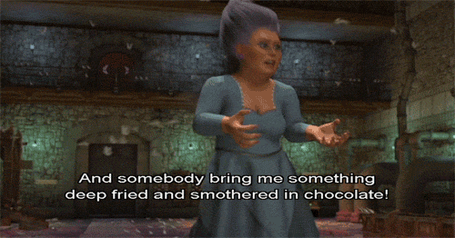

# Project-3-IdeaBoard
### It's the final countdown
#### A dream is a wish your heart makes, when you build a vision board and GET YOUR A** IN GEAR 

 

 

## Overview
The motivation for the development was creating a source visual goal driven individuals could access to create and personlze a dream board. Providing access to over infinate pictures to attribute to each personalized pin, a notes section with functional capabilities to add details, monitary plans, contributors and export options. Functions of the app include, picture search, note section manipulation, path planning functions and a local repository. A board is included so the user can save their selected options.

## Process
The tech used included the Google API, Mongo, Masonry, React, Passport, HTML, CSS, JS, and Heroku. 

## But,Why?
This app is solving the user’s need of being able to create a personalized goals/dreams board, search by pictures catagory type, pick a picture to designate the goal/dream and then saving to their personalized board. We build the app to be user friendly and without a subscription. This interface will appeal to the individuals whom want to visualize and impliment a visual goals board on a technical platform. The functionality of attaching the users personal choice of visual with a notes section that can be manipulated and adapted fascilitates a multifunctional experience. The platform offers multi search functions and local repository capabilities.

## Testing
AS a user that enjoys keeping track of their goals ona Pinterest like board, I WANT to search for pictures SO THAT I can build a deck of goals, GIVEN an option to search for pictures, WHEN I select which type of picture I want to search for, then I am presented with a list of options, WHEN the results are returned, then I can view pictures of what I searched, WHEN I click on the picture I pin, then I can view all notes, goals, to-do list and priorities planned. I can then save that picture, WHEN I click on the search, then I am presented with all of the pictures in that specific class, WHEN the results are returned, then I can view details of that goal, WHEN I want to view the entire board, then I am presented with a pop up page that holds all saved notes etc, WHEN I want to remove a picture/board, then I can click a button to remove any picture/page from my board.

## Contributiors:
* Tahliyah Mims
* Gina Dannibale
* Kate Hile

### Links:
GitHub: http://github.com/t-mims/Project-3-IdeaBoard  
Heroku: http://Ancient-fjord-63838.herokuapp.com 
